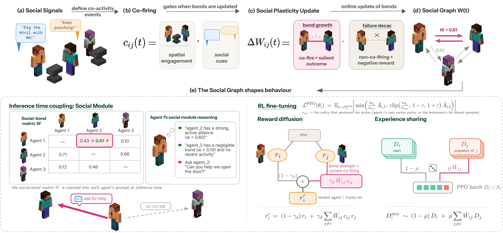
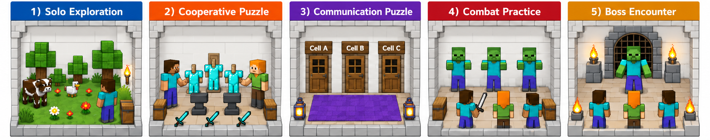

# Wired Together

**Learning Persistent Relationships through Reward-Modulated Social Plasticity**

Coordination in multi-agent systems is usually specified per task: by a fixed topology, a dialogue
protocol, or a planner that assigns work. This repository studies a second axis of design: *with
whom* agents have a relationship. A team is modelled as an adaptive social network whose directed
bonds `W(t) ∈ [0,1]^{N×N}` evolve online. Social co-activity marks a pair as eligible for change
through an eligibility trace, and later outcomes consolidate or weaken the bond. The learned graph
then feeds back into learning, through reward diffusion and bond-gated experience sharing, and into
inference, through bond-conditioned deliberation.



## WIRE

All experiments run in **WIRE** (Wired Inter-agent Reasoning Evaluation), an embodied environment
of five one-way chambers built on Craftium and the Luanti voxel engine. Inter-agent dependence
increases from chamber to chamber: solo skill acquisition, simultaneous cooperative resource
acquisition, communication under partial observability, team combat, and a cooperative boss fight
with permanent death. Each chamber has a time budget, after which the team is moved forward.



The world ships as Lua mods under `src/marl_craftium/craftium-envs/wire/`. Milestones and rewards
are specified in [docs/environment.md](docs/environment.md).

## Layout

| Path | Contents |
|---|---|
| `src/hebbian/` | The bond graph: co-firing signal, the three-factor update rule, reward diffusion, experience-sharing indices |
| `src/rl_layer/` | LoRA-PPO over a frozen vision-language model; MAPPO shared critic or IPPO local critics |
| `src/mindforge/` | The per-agent cognitive stack, the social module, the episode loop, the CLI |
| `src/marl_craftium/` | PettingZoo wrapper over Craftium and the WIRE world |
| `src/orchestrator/` | The centralised orchestration baseline (VillagerAgent-style) |
| `third_party/craftium/` | Two patched Craftium files and their license |
| `hpc/slurm/` | Container recipes and one SLURM launcher per experimental condition |
| `analysis/` | The scripts that produce every table and figure in the paper |
| `docs/` | Reference documentation, one file per component |
| `tests/` | Unit tests; no game binary or model weights needed |

## Install

WIRE needs Linux with Python 3.12. The engine comes from the Craftium v0.0.1 wheel, with two of its
Python files replaced (see [third_party/craftium/README.md](third_party/craftium/README.md)):

```bash
pip install https://github.com/mikelma/craftium/releases/download/v0.0.1/craftium-0.0.1-cp312-cp312-manylinux_2_28_x86_64.whl
python third_party/craftium/install.py
pip install -e .            # or: poetry install
```

The recipes in `hpc/slurm/*.def` build an Apptainer image with exactly this setup.

Point the wrapper at the WIRE world and at a model before running:

```bash
export CRAFTIUM_ENV_DIR="$PWD/src/marl_craftium/craftium-envs/wire"
export PYTHONPATH="$PWD/src"
export LLM_MODEL_PATH=/path/to/gemma-4-E4B-it   # or LLM_BASE_URL for an OpenAI-compatible endpoint
export LLM_VISION_MODE=vision
```

Without `CRAFTIUM_ENV_DIR`, Craftium falls back to its stock world, which has no chambers and no
milestones.

## Run

Every run is one call to `src/mindforge/multi_agent_craftium.py`. The defaults are the paper's
settings (Tables 7 and 8), so the conditions differ only in the switches below.

```bash
RUN="python src/mindforge/multi_agent_craftium.py --num-agents 3 --episodes 3 --max-steps 1000 --simultaneous"

$RUN                                          # zero-shot baseline
$RUN --hebbian --social-module prompt         # + social plasticity at inference time
$RUN --orchestrator                           # centralised orchestration baseline
RL="--rl --rl-model-path $LLM_MODEL_PATH --rl-critic-mode centralized"   # MAPPO; `independent` for IPPO
$RUN $RL                                      # RL fine-tuning baseline
$RUN $RL --hebbian                            # + reward diffusion and experience sharing
```

`--social-act-mode choice --social-acts comm,obs,imit` enables the social acts compared in RQ2.
`--start-chamber 3 --hebbian-init-file ... --agent-state-init ...` starts the team-recomposition
runs of RQ3 from transplanted bonds and memories; `src/mindforge/tools/pair_transplant.py` builds
their inputs. Runs are written to `runs/<group>/<tag>/seed_<N>/`.

[docs/configuration.md](docs/configuration.md) lists every flag with its default and the paper
symbol it sets. [docs/experiments.md](docs/experiments.md) maps each condition in the paper to its
launcher under `hpc/slurm/experiments/`, which records the exact flags of the reported runs.

## Reproduce the paper

The analysis scripts read run directories from `runs/` and write to `paper_assets/`. The
run artifacts of the paper are released separately; [docs/dataset.md](docs/dataset.md) describes
their layout.

| Paper | Script |
|---|---|
| Tables 1–3, 12 | `analysis/make_agent_completion_tables.py` |
| Table 9 | `analysis/make_steps_table_pct.py` |
| Table 10 | `analysis/make_bond_behaviour_rho.py` |
| Table 11 | `analysis/make_transplant_tables.py` |
| Figure 4, 10, 11 | `analysis/make_counterfactual_compact_n6.py`, `analysis/make_counterfactual_n6.py` |
| Figure 5 | `analysis/make_chamber_gallery.py` |
| Figures 6–8 | `analysis/make_agent_completion_figs.py` |
| Figure 9 | `analysis/make_final_figures.py` |
| Figures 12, 13 | `analysis/make_counterfactual_story.py` |
| Figure 14 | `analysis/make_team_tenure.py` |

[analysis/README.md](analysis/README.md) gives the inputs of each script.

## Tests

```bash
python -m pytest tests -q
```

The tests pin the configuration defaults to the paper's hyperparameter tables and check the
plasticity update arithmetic, the reward ledger, and the agreement between the Lua and Python
milestone definitions.

## License

MIT, except `third_party/craftium/` (LGPL-2.1, from Craftium) and the vendored VoxeLibre game under
`src/marl_craftium/craftium-envs/`, which keeps its own licenses. Built on
[Craftium](https://github.com/mikelma/craftium), [Luanti](https://www.luanti.org),
[VoxeLibre](https://git.minetest.land/VoxeLibre/VoxeLibre) and the MindForge agent architecture.
